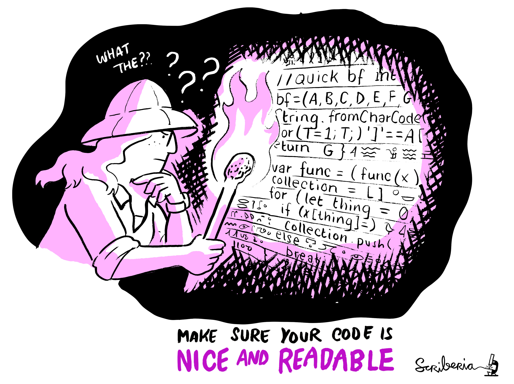
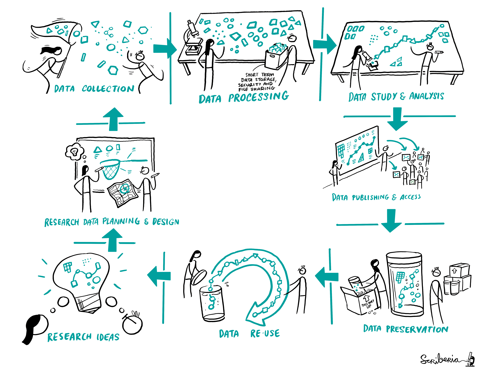
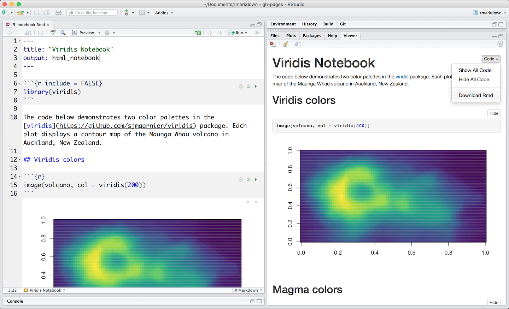
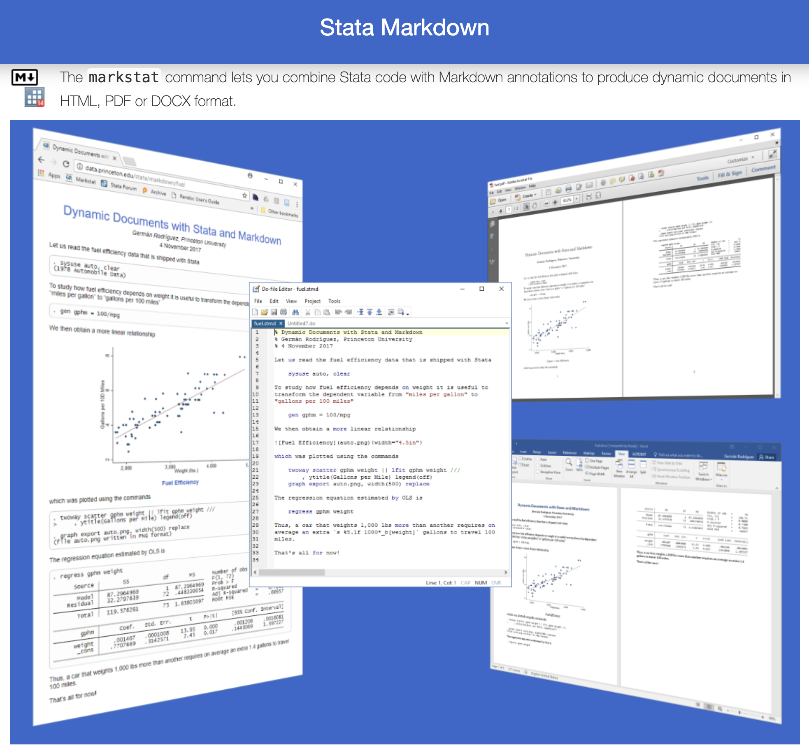

```{r xaringanExtra-setup, echo=FALSE}
xaringanExtra::use_tile_view()
xaringanExtra::use_extra_styles(
  hover_code_line = TRUE
)
```

```{css, echo = FALSE}
# .remark-slide-content {
#   font-size: 28px;
#   padding: 20px 80px 20px 80px;
# }
# .remark-code, .remark-inline-code {
#   background: #f0f0f0;
# }
# .remark-code {
#   font-size: 24px;
# }
.huge .remark-code { /*Change made here*/
  font-size: 200% !important;
}
.small1 .remark-code { /*Change made here*/
  font-size: 80% !important;
}
.small2 .remark-code { /*Change made here*/
  font-size: 65% !important;
}
.tiny .remark-code { /*Change made here*/
  font-size: 50% !important;
}
.tinyq .remark-code { /*Change made here*/
  font-size: 5% !important;
}
.big1_t { font-size: 120% }
.big2_t { font-size: 150% }
.big3_t { font-size: 200% }
.small0_t { font-size: 90% }
.small1_t { font-size: 80% }
.small2_t { font-size: 60% }
.tiny1_t { font-size: 40% }
.tiny2_t { font-size: 20% }

.text_right {
  vertical-align: bottom !important; 
  text-align: right !important;
}

.text_left {
  vertical-align: bottom !important; 
  text-align: left !important;
}
```


```{r echo = FALSE, out.width=600, fig.align='center'}

```

[The Turing Way Community, & Scriberia (2020)](https://zenodo.org/record/3695300#.YDx7Ml1Kj3Q)

---

class: inverse

# [Overview]()

## 1. **Open Science 🧠**
<br>
.big2_t[
.pull-left[

###2.  **Markdown 📝**
- What is?
- How to use?

### 3. **Github 😸**
- What is?
- How to use?
]
]

.pull-right[


]

---

# The Research Cycle

```{r echo = FALSE, out.width=600, fig.align='center'}

```

[The Turing Way Community, & Scriberia (2020)](https://zenodo.org/record/3695300#.YDx7Ml1Kj3Q)

---

# Open Science

<br><br>
- There is no formal definition of open science. 

<br>

> Efforts by researchers, governments, research funding agencies or the scientific community itself to make the
primary outputs of publicly funded research results – publications and the research data – publicly
accessible in digital format with no or minimal restriction as a means for accelerating research; these
efforts are in the interest of enhancing transparency and collaboration, and fostering innovation.

<br>

[OECD (2015)](https://www.fct.pt/dsi/docs/Making_Open_Science_a_Reality.pdf)

---

# FAIR principles

.pull-left[
<br><br>

- In 2016, the [FAIR Guiding Principles for scientific data management and stewardship](https://www.nature.com/articles/sdata201618) were published in Scientific Data. 

- The authors intended to provide guidelines to improve the **F**indability, **A**ccessibility, **I**nteroperability, and **R**euse of digital assets. 

[GO FAIR](https://www.go-fair.org/fair-principles/)
]

.pull-right[
<br><br><br>

```{r echo = FALSE, out.width=600, fig.align='center'}
knitr::include_graphics("_figs/FAIRPrinciples.jpg")
```

]

---

# Reproducible Journey

<br>
```{r echo = FALSE, out.width=600, fig.align='center'}
knitr::include_graphics("_figs/ReproducibleJourney.jpg")
```

[The Turing Way Community, & Scriberia (2020)](https://zenodo.org/record/3695300#.YDx7Ml1Kj3Q)

---

# Ten arguments against Open Science

<br>

### 1. Open Science is **not always open** 
### 2. Open Science has **historically lacked diversity** and exhibited a non-inclusive culture 
### 3. Current open culture is built on the **Western mindset** 
### 4. **My institute’s policy** would never allow me to share my work openly 
### 5. My work is **not good enough** to share 

[Ten arguments against Open Science that you can win](https://www.software.ac.uk/blog/2020-12-17-ten-arguments-against-open-science-you-can-win)

---

# Ten arguments against Open Science

<br>
### 6. I will definitely **get scooped**
### 7. I wrote this **code for my data set only**
### 8. **I can’t maintain it**, so why bother sharing 
### 9. What if people **judge** my code and preprint? 
### 10. My work **will not be acknowledged** and that’s not going to help my career 

[Ten arguments against Open Science that you can win](https://www.software.ac.uk/blog/2020-12-17-ten-arguments-against-open-science-you-can-win)

---

# Open Research

<br>
```{r echo = FALSE, out.width=600, fig.align='center'}
knitr::include_graphics("_figs/openresearch.jpg")
```

[The Turing Way Community, & Scriberia (2020)](https://zenodo.org/record/3695300#.YDx7Ml1Kj3Q)

---

class: inverse, center

<center>
<blockquote class="twitter-tweet" data-lang="es" width="400"><p lang="es" dir="ltr">"When authors say they will "make data available upon request"

'#OpenScienceGif </p>&mdash; Heidi Seibold (@HeidiBaya) <a href="https://twitter.com/HeidiBaya/status/1335897311931740163?s=20">7 December 2020</a></blockquote>
</center>

---

class: inverse, center, middle

# Open Research Tools 🧰

.big3_t[
[Markdown]()
]

---

# Markdown: What is?

<br>
.pull-left[

Markdown is a **plain text formatting syntax** aimed at making writing for the internet easier. The philosophy behind Markdown is that plain text documents should be readable without tags mussing everything up, but there should still be ways to add text modifiers like lists, bold, italics, etc.

It’s possible you’ve encountered Markdown without realizing it. Facebook chat, Skype, and Reddit all let you use **different flavors** of Markdown to format your messages.
]

.pull-right[
<br>

```{r echo = FALSE, out.width=600, fig.align='center'}
knitr::include_graphics("_figs/md_flavs.png")
```

]

---

# Markdown: How to use?

<br>
```{r echo = FALSE, out.width=700, fig.align='center'}

```

[R Markdown: The Definitive Guide - Yihui Xie](https://bookdown.org/yihui/rmarkdown/)

---

# Markdown: How to use?

<br>

```{r echo = FALSE, out.width=500, fig.align='center'}

```

[Stata Markdown - Germán Rodriguez](https://data.princeton.edu/stata/markdown)

---

# Example

<br><br><br><br><br>
.center[
.big3_t[
[Malaria inequality in SSA](https://bookdown.org/gabc91/mal_ineq/)
]
]

---

class: inverse, center, middle

# Open Research Tools 🧰

.big3_t[
[Github]()
]

