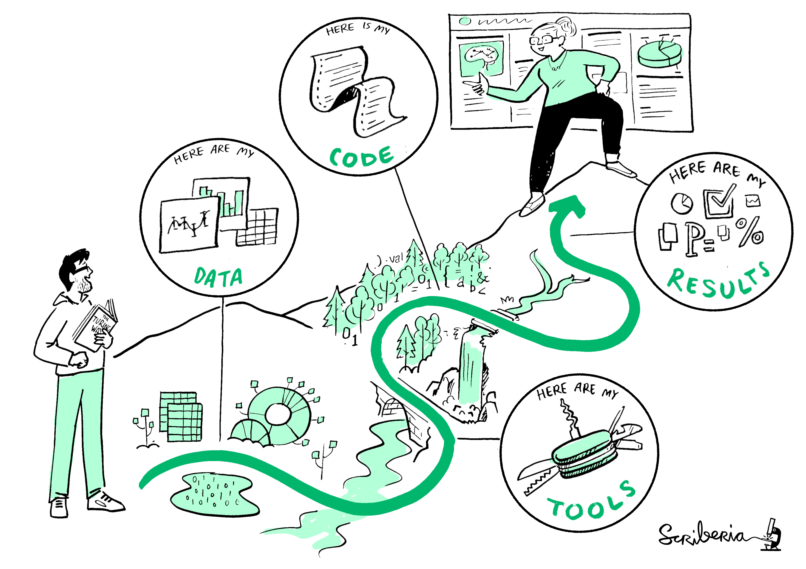
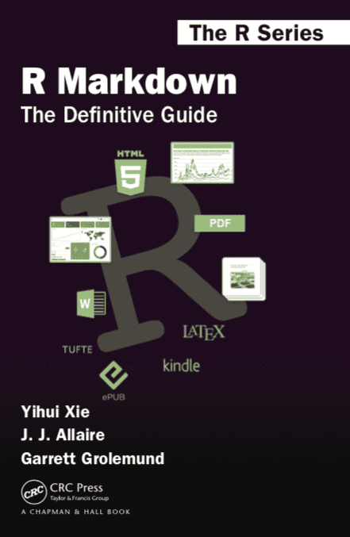

```{r xaringanExtra-setup, echo=FALSE}
xaringanExtra::use_tile_view()
xaringanExtra::use_extra_styles(
  hover_code_line = TRUE
)
```

```{css, echo = FALSE}
# .remark-slide-content {
#   font-size: 28px;
#   padding: 20px 80px 20px 80px;
# }
# .remark-code, .remark-inline-code {
#   background: #f0f0f0;
# }
# .remark-code {
#   font-size: 24px;
# }
.huge .remark-code { /*Change made here*/
  font-size: 200% !important;
}
.small1 .remark-code { /*Change made here*/
  font-size: 80% !important;
}
.small2 .remark-code { /*Change made here*/
  font-size: 65% !important;
}
.tiny .remark-code { /*Change made here*/
  font-size: 50% !important;
}
.tinyq .remark-code { /*Change made here*/
  font-size: 5% !important;
}
.big1_t { font-size: 120% }
.big2_t { font-size: 150% }
.big3_t { font-size: 200% }
.small0_t { font-size: 90% }
.small1_t { font-size: 80% }
.small2_t { font-size: 60% }
.tiny1_t { font-size: 40% }
.tiny2_t { font-size: 20% }

.text_right {
  vertical-align: bottom !important; 
  text-align: right !important;
}

.text_left {
  vertical-align: bottom !important; 
  text-align: left !important;
}
```


```{r echo = FALSE, out.width=800, fig.align='center'}
knitr::include_graphics("_figs/CultureShift.jpg")
```

[The Turing Way Community, & Scriberia (2020)](https://zenodo.org/record/3695300#.YDx7Ml1Kj3Q)

---

class: inverse

# [Overview]()

.big2_t[
.pull-left[

### 1. **Open Science 🧠**

<br>

###2.  **Markdown 📝**

<br>

### 3. **GitHub 😸**

<br>

### 4. **Data Repositories 🗄️**

]
]

.pull-right[
<br><br><br>


]

---

# The Research Cycle

```{r echo = FALSE, out.width=600, fig.align='center'}
knitr::include_graphics("_figs/ResearchCycle.jpg")
```

[The Turing Way Community, & Scriberia (2020)](https://zenodo.org/record/3695300#.YDx7Ml1Kj3Q)

---

class: inverse, center

<center>
<blockquote class="twitter-tweet" data-lang="es" width="400"><p lang="es" dir="ltr">"When authors say they will "make data available upon request"

'#OpenScienceGif </p>&mdash; Heidi Seibold (@HeidiBaya) <a href="https://twitter.com/HeidiBaya/status/1335897311931740163?s=20">7 December 2020</a></blockquote>
</center>

---

# Open Research

<br>
```{r echo = FALSE, out.width=600, fig.align='center'}
knitr::include_graphics("_figs/openresearch.jpg")
```

[The Turing Way Community, & Scriberia (2020)](https://zenodo.org/record/3695300#.YDx7Ml1Kj3Q)

---

# Open Science

<br><br>
- There is no formal definition of open science. 

<br>

> Efforts by researchers, governments, research funding agencies or the **scientific community** itself to make the primary outputs of publicly funded research results – publications and the research data – publicly accessible in digital format with **no or minimal restriction** as a means for **accelerating research**; these efforts are in the interest of enhancing transparency and collaboration, and fostering innovation.

<br>

[OECD (2015)](https://www.fct.pt/dsi/docs/Making_Open_Science_a_Reality.pdf)

---

# FAIR principles

.pull-left[
<br><br>

- In 2016, the [FAIR Guiding Principles for scientific data management and stewardship](https://www.nature.com/articles/sdata201618) were published in Scientific Data. 

- The authors intended to provide guidelines to improve the **F**indability, **A**ccessibility, **I**nteroperability, and **R**euse of digital assets. 

[GO FAIR](https://www.go-fair.org/fair-principles/)
]

.pull-right[
<br><br><br>

```{r echo = FALSE, out.width=600, fig.align='center'}
knitr::include_graphics("_figs/FAIRPrinciples.jpg")
```

]

---

# Reproducible Journey

<br>
```{r echo = FALSE, out.width=600, fig.align='center'}

```

[The Turing Way Community, & Scriberia (2020)](https://zenodo.org/record/3695300#.YDx7Ml1Kj3Q)

---

class: inverse, center, middle

# Open Research Tools 🧰

.big3_t[
[Markdown]()
]

---

# Markdown: What is?

<br>
.pull-left[

Markdown is a **plain text formatting syntax** aimed at making writing for the internet easier. The philosophy behind Markdown is that plain text documents should be readable without tags mussing everything up, but there should still be ways to add text modifiers like lists, bold, italics, etc.

It’s possible you’ve encountered Markdown without realizing it. Facebook chat, Skype, and Reddit all let you use **different flavors** of Markdown to format your messages.
]

.pull-right[

```{r echo = FALSE, out.width=600, fig.align='center'}

```

]

---

# Markdown: How to use?

<br>
```{r echo = FALSE, out.width=700, fig.align='center'}
knitr::include_graphics("_figs/rmd.png")
```

[R Markdown: The Definitive Guide - Yihui Xie](https://bookdown.org/yihui/rmarkdown/)

---

# Markdown: How to use?

<br>

```{r echo = FALSE, out.width=500, fig.align='center'}
knitr::include_graphics("_figs/markstat.png")
```

[Stata Markdown - Germán Rodriguez](https://data.princeton.edu/stata/markdown)

---

# Markdown: Where to start?

.pull-left[

<br><br><br><br><br>
.big3_t[
**R Markdown: The Definitive Guide - Yihui Xie**
]

[book link](https://data.princeton.edu/stata/markdown)
]

.pull-right[
<br>

```{r echo = FALSE, out.width=300, fig.align='center'}

```

]


---

# Markdown: Example

<br><br><br><br><br>
.center[
.big3_t[
[Malaria inequality in SSA](https://bookdown.org/gabc91/mal_ineq/)
]
]

---

class: inverse, center, middle

# Open Research Tools 🧰

.big3_t[
[GitHub]()
]

---

# Git: What is?

<br>
.pull-left[

```{r echo = FALSE, out.width=300, fig.align='center'}
knitr::include_graphics("_figs/Git-Icon.png")
```

]

.pull-right[
A **version control system (VCS)** tracks the history of changes as people and teams collaborate on projects together.

- Which changes were made?
- Who made the changes?
- When were the changes made?
- Why were changes needed?

According to the latest [Stack Overflow developer survey](https://insights.stackoverflow.com/survey/2017#technology), more than **70 %** of developers use Git, making it the most-used VCS in the world.
]

---

# GitHub: What is?

.pull-left[
- _**GitHub**_ is a _Git hosting repository_ that provides developers with tools to ship better code through command line features, issues (threaded discussions), pull requests, code review, or the use of a collection of free and for-purchase apps in the GitHub Marketplace. 

- GitHub builds collaboration directly into the development process. Work is organized into repositories, where developers can outline requirements or direction and set expectations for team members.
]

.pull-right[
<br><br>

```{r echo = FALSE, out.width=600, fig.align='center'}
knitr::include_graphics("_figs/GitHub-cat-logo.jpg")
```

]

---

# GitHub: How to use?

.pull-left[
- A _**repository**_, or Git project, encompasses the entire collection of files and folders associated with a project, along with each file’s revision history.
]

.pull-right[
- The file history appears as snapshots in time called _**commits**_, and the commits exist as a linked-list relationship, and can be organized into multiple lines of development called _**branches**_.
]

<br>

```{r echo = FALSE, out.width=600, fig.align='center'}
knitr::include_graphics("_figs/git_rebase.png")
```

---

# GitHub: Where to start?

.pull-left[

<br><br><br><br><br>
.big3_t[
**Github Desktop**
]

[download link](https://desktop.github.com/)
]

.pull-right[

```{r echo = FALSE, out.width=400, fig.align='center'}
knitr::include_graphics("_figs/ghd_landing.png")
```
<br>
```{r echo = FALSE, out.width=400, fig.align='center'}
knitr::include_graphics("_figs/ghd_screenshot-mac.png")
```

]


---

# GitHub: Example

<br><br><br><br><br>
.center[
.big3_t[
[Health Innovation Lab Repository](https://github.com/healthinnovation)
]
]

---

class: inverse, center, middle

# Open Research Tools 🧰

.big3_t[
[Data Repositories]()
]

---

# Data Repositories: What is?

.pull-left[

- A data repository can be defined as a place that holds data, makes data available to use, and organizes data in a logical manner. 

- Data repositories may have specific requirements concerning subject or research domain; data re-use and access; file format and data structure; and the types of metadata that can be used. 

- Get a permanent URLs to the repository as a **Digital Object Identifier (DOI)**

[NIH](https://nnlm.gov/data/thesaurus/data-repository)

]

.pull-right[

<br><br><br><br>
```{r echo = FALSE, out.width=400, fig.align='center'}

```

]

---

# Data Repositories: Examples

```{r echo = FALSE, out.width=450, fig.align='center'}

```


.center[
Table: [Scientific Data](https://www.nature.com/sdata/policies/repositories#general)

[DRYAD](https://datadryad.org/stash) | [figshare](https://figshare.com/) | [Harvard Dataverse](https://dataverse.harvard.edu/) | [Zenodo](https://zenodo.org/)
]

---

# This presentation

.big2_t[
.center[
[🖥️ Slides](https://ucsd-reprod.netlify.app)
]

.pull-left[
.center[
[📝 RMarkdown]()

```{r echo = FALSE, out.width=600, fig.align='center'}

```

]

]

.pull-right[

.center[
[😸 GitHub](https://github.com/gcarrascoe/UCSD_reproducibility)

```{r echo = FALSE, out.width=600, fig.align='center'}

```

]
]
]

---

# Resources

<br><br><br><br>
- [Mi próximo artículo científico en R - Florencia D'Andrea](https://flor14.github.io/rladies-jujuy/presentacion.html?panelset=compendio&panelset1=bibliograf%25C3%25ADa#1)
- [Git project](https://git-scm.com/)
- [GitHub Guides](https://guides.github.com/introduction/git-handbook/)
- [Sharing on Short Notice](https://rstudio-education.github.io/sharing-short-notice/#1)
- [R, Open Research, and Reproducibility](https://r-openresearch-reproducibility.netlify.app/)
- [The Turing Way](https://the-turing-way.netlify.app/welcome)
- [Ten arguments against Open Science that you can win](https://www.software.ac.uk/blog/2020-12-17-ten-arguments-against-open-science-you-can-win)

---

class: inverse, center, middle

### Gabriel Carrasco Escobar, MS, PhD(c)
#### ✉️ [gabriel.carrasco@upch.pe]()
#### 🐦 [@Gabc91]()